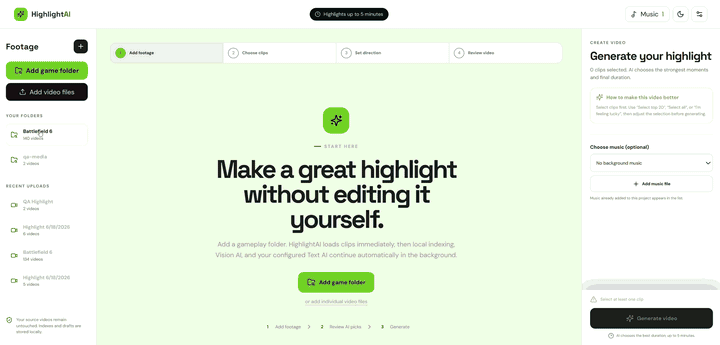
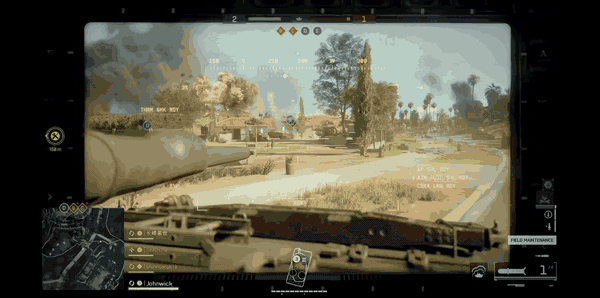

# HighlightAI

HighlightAI is a local-first desktop app for turning raw gameplay recordings into polished highlight videos. It imports or links recordings, analyzes video and audio signals with FFmpeg, optionally uses an OpenAI-compatible vision model, lets users confirm or reject exact highlight periods, and renders local MP4 exports.

The app is designed for long local footage folders where the editor should keep evidence visible: what was indexed, what AI reviewed, which moments were confirmed, which moments were rejected, and why a render did or did not proceed.

## Preview

### App UI

The desktop workspace for importing recordings, reviewing candidate clips, configuring AI, and starting local render jobs.



### Generated Video

An example final video rendered by HighlightAI from selected gameplay moments.

[Watch the generated video on YouTube](https://youtu.be/jIYO9-3kVyE)



## What It Does

- Links local recording folders without duplicating source footage.
- Probes video metadata with FFprobe.
- Finds scene changes, audio peaks, action scores, highlight starts, thumbnails, previews, and reusable candidate windows with FFmpeg.
- Runs optional Vision AI review through an OpenAI-compatible multimodal endpoint.
- Tracks AI decisions, verified events, uncertain moments, rejected low-signal footage, and user-confirmed highlight periods.
- Provides a review workspace for trimming, confirming, skipping, or permanently rejecting candidate highlights.
- Builds drafts from confirmed highlights first, then verified AI events, strong reviewed candidates, fast-index windows, and local-signal fallbacks.
- Optionally sends the planned timeline through a final visual review before rendering.
- Pauses render jobs for user review when the final reviewer cannot approve the timeline.
- Renders MP4 exports locally, with optional music and one-pass or two-pass music-length generation.

## Architecture

```text
Electron desktop shell
  |
  | opens packaged app or Vite dev server
  v
React + Vite UI
  |
  | typed fetch client
  v
Express local API
  |
  | project JSON, job JSON, uploads, previews, thumbnails, exports
  v
Local data root
  |
  +-- FFprobe metadata probing
  +-- FFmpeg signal analysis and rendering
  +-- Optional Vision/Text AI endpoints
  +-- User highlight confirmations and rejections
```

### Frontend

The frontend lives in `src/`.

- `src/App.tsx` owns the main workflow: imports, project loading, clip library, highlight review, AI settings, background jobs, draft generation, render progress, and generated-video previews.
- `src/services/api.ts` is the typed local API client. It also sanitizes user-facing errors so raw FFmpeg logs, local paths, endpoints, and secrets do not leak into the UI.
- `src/services/analyzer.ts` contains formatting, duration, preset, and asset helpers.
- `src/types.ts` defines the shared project, media, job, draft, review, and AI contracts.
- `src/App.path-panel.test.tsx` and `src/services/api.test.ts` cover UI workflow and API error-sanitization behavior.

During Vite development the client calls `http://127.0.0.1:4312/api`. In production it uses same-origin `/api` served by Express.

### Backend

The backend lives in `server/`.

- `server/index.mjs` starts the Express API, owns storage paths, serves media, manages ingest, fast indexing, Vision AI review, highlight confirmation/rejection, draft generation, render jobs, final review pauses, recovery, and cleanup.
- `server/media.mjs` wraps FFmpeg/FFprobe and contains candidate scoring, planning, segment alignment, visual-review edits, music extension, and rendering helpers. Shared JSON persistence lives in `server/json-store.mjs`, and the render duration cap lives in `server/policy.mjs`.
- `server/dev.mjs` runs the API and Vite dev server together.
- `server/media.test.ts` covers planning, review, and render-helper behavior.

The backend uses JSON files on disk rather than a database. Development data lives under `data/`. Packaged Electron builds set `HIGHLIGHTAI_DATA_ROOT` to the Electron user-data folder.

### Desktop Shell

The Electron shell lives in `desktop/`.

- `desktop/main.mjs` creates the window, starts the local API in packaged mode, waits for `/api/health`, and loads either the packaged app or Vite dev URL.
- `desktop/preload.cjs` exposes desktop-only operations such as choosing a local folder and showing exports in the OS file browser.

## Processing Flow

1. Import browser-selected files or link a local folder from the desktop shell.
2. Probe each video for duration, codecs, frame rate, resolution, bitrate, and audio availability.
3. Build local signals: scene changes, loudness peaks, action scores, highlight starts, thumbnails, previews, and candidate windows.
4. Optionally run Vision AI review. Results are saved as compact metadata: tags, traits, scores, events, attempts, AI decisions, and rejection reasons.
5. Review highlight candidates in the app. Users can trim and confirm useful periods, skip candidates for the current session, or save permanent not-highlight rejections.
6. Generate a draft. The planner prefers user-confirmed moments, then verified AI events, strong AI candidates, fast-index windows, and local-signal fallback moments.
7. Optionally run final visual review on the planned timeline. Approved timelines continue; revised timelines can be trimmed; rejected timelines enter a review-needed state.
8. Render locally with FFmpeg. Music can be omitted, used once, or repeated for a longer two-pass edit.
9. Save the export and source metadata under the local data root.

## Review Workflow

The current workflow is built around human-in-the-loop quality control:

- **AI verified** moments have a visible payoff and can feed generation directly.
- **Potential highlight** moments come from uncertain Vision AI timelines or fast-index windows.
- **Local signal** moments come from deterministic audio/scene/action analysis when AI evidence is weak.
- **Confirmed** moments are treated as high-confidence source material in future drafts.
- **Rejected** not-highlight ranges are removed from future candidate lists and draft plans.
- **Final review** can trim or reject planned shots before rendering. If it cannot approve the automatic timeline, the render job returns `needs_review` instead of silently exporting a weak video.

## AI Coverage Helper

The project includes a command-line helper for checking whether a local project has enough AI-reviewed or auto-usable source material:

```powershell
npm run ai:coverage
```

Configuration is read from environment variables:

```text
HIGHLIGHTAI_API=http://127.0.0.1:4312/api
PROJECT_ID=<optional project id>
VISION_ENDPOINT=http://127.0.0.1:11434/v1/chat/completions
VISION_MODEL=qwen2.5vl:7b
VISION_API_KEY=
MAX_CHECK_SECONDS=1800
FRAMES_PER_VIDEO=10
SAMPLE_INTERVAL=6
TARGET_RATE=95
```

The helper chooses the latest usable project when `PROJECT_ID` is not set, reports current coverage, checks model availability, optionally runs first-pass and refinement Vision AI review, then reports whether the target AI generation coverage passed.

## Project Layout

```text
desktop/              Electron main process and preload bridge
server/               Express API, job recovery, FFmpeg/AI orchestration
src/                  React app, API client, shared types, frontend tests
scripts/              Packaging, mock AI, coverage, icon, FFmpeg, and QA utilities
docs/                 Workflow notes, QA audit, assets, and engineering docs
build/                Source build assets such as app icons
data/                 Local runtime data, ignored by Git
dist/                 Vite production build, ignored by Git
release/              Electron package output, ignored by Git
vendor/               Prepared local FFmpeg assets, ignored by Git
```

## Runtime Data

`data/` is generated at runtime and intentionally ignored by Git. It can contain:

- uploaded files and linked project records;
- project JSON under `data/projects/`;
- background job JSON under `data/jobs/`;
- thumbnails, previews, preprocess frames, and temporary render files;
- rendered exports under `data/exports/`;
- AI review state, highlight confirmations, highlight rejections, and QA reports.

Large source recordings, generated videos, package outputs, tool state, logs, and local secrets are ignored in `.gitignore`.

## Requirements

- Node.js 20 or newer.
- npm.
- FFmpeg and FFprobe on `PATH` for development.
- Optional: Ollama or another OpenAI-compatible multimodal endpoint for Vision AI.

## Install

```powershell
npm install
```

## Run

API only:

```powershell
npm run api
```

Vite frontend only:

```powershell
npm run dev
```

Full local web app:

```powershell
npm run dev:full
```

Desktop development:

```powershell
npm run desktop:dev
```

## Build And Verify

Production web build:

```powershell
npm run build
```

Windows portable desktop package:

```powershell
npm run package:win
```

Full verification:

```powershell
npm run verify
```

`npm run verify` runs the TypeScript build, Vite build, Vitest suite, and backend syntax checks.

## AI Configuration

Vision review is optional. The app can use local Ollama, a LAN-hosted server, or a cloud endpoint that exposes an OpenAI-compatible chat completions API.

Default local vision settings:

```text
Endpoint: http://127.0.0.1:11434/v1/chat/completions
Model: qwen2.5vl:7b
API key: blank
```

Local Ollama endpoints are capped to one active vision request to reduce GPU contention. LAN or cloud endpoints can use more workers through the app's AI settings.

## Privacy Model

- Raw footage stays local unless the user explicitly configures and starts AI review against an external endpoint.
- FFmpeg analysis and rendering run locally.
- Runtime project data is stored under `data/` in development or Electron user data in packaged builds.
- API keys for active AI jobs are kept in process memory and are not written to job JSON.
- User-facing errors are sanitized to avoid exposing low-level renderer output, local paths, endpoints, tokens, or secrets.
- Generated media and local project data are ignored by Git.

## License

MIT
